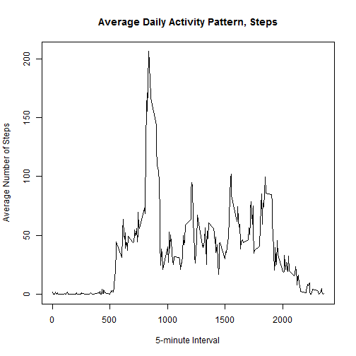

```r
#read activity data into r and set to ad
ad <- read.csv("activity.csv")
```

***Question 1:  What is the mean total of steps taken per day?***  
      Steps  
      1. Aggregate steps data by date to calculate total steps per day  
      2. Plot histogram of total steps per day  
      3. Overlay a normal dist curve (not required, just playing around a bit)  
      4. Calculate and report mean and median information


```r
aggdata <-aggregate(ad$steps, by=list(ad$date), FUN=sum, na.rm=TRUE)
breaks = 10
hist(aggdata$x, xlab="Total Number of Steps/Day", 
     main="Distribution of Total Steps/Day", 
     col="lightblue", breaks=10)
curve(dnorm(x, mean=mean(aggdata$x), 
            sd=sd(aggdata$x))*(max(aggdata$x)-min(aggdata$x))*breaks, 
      add=TRUE, 
      col="darkblue", lwd=2)
```

 

```r
mean_total_steps <- round(mean(aggdata$x), digits=0)
median_total_steps <- median(aggdata$x)
```
The mean total number of steps taken per day is 9354.  
The median total number of steps taken per day is 10395.  
####################################################################################
  
***Question 2:  What is average daily activity pattern?***  
      Steps  
      1. Aggregate steps data by 5 minute interval to calculate total steps per day  
      2. Plot average daily activity pattern of steps taken vs. the 5 minute intervals    
      3. Determine which 5-minute interval, on average, contains the maximum number of steps  


```r
aggdata2 <-aggregate(ad$steps, by=list(ad$interval), FUN=mean, na.rm=TRUE)
plot(x=aggdata2$Group.1, y=aggdata2$x, type = "l",
     xlab="5-minute Interval",
     ylab="Average Number of Steps",
     main="Average Daily Activity Pattern, Steps")
```

 

```r
#get index of maximum average steps
which.max(aggdata2$x)
```

```
## [1] 104
```

```r
#from index find corresponding 5-minute interval
maxinterval <- aggdata2[104,1]
```
On average, the 835th interval contains the most number of steps in a typical day. This corresponds to 8:35-8:40 am. 
####################################################################################  

***Missing Values***  
*Calculate and report the total number of missing values in the dataset (i.e. the total number of rows with NAs.*  

```r
incomplete_cases <- sum(!complete.cases(ad))
```
The total number of missing values is 2304.  

*Devise a strategy for filling in all of the missing values in the dataset. The strategy does not need to be sophisticated. For example, you could use the mean/median for that day, or the mean for that 5-minute interval, etc.*  
Using the mode of the data may introduce less bias than the mean or the median. The mode represents the most frequent and therefore most likely event.  I will fill in the missing values with the mode of the steps in a given interval.  

```r
#fill in steps with average steps for a given interval over all days
#first create duplicate dataframe to leave the original intact and then fill that one in...
ad_filled <- ad
for (i in 1:nrow(ad)) {
      if (complete.cases(ad[i,])==F) {
            interval <- ad[i,3]
            mean_steps <- aggdata2[aggdata2$Group.1==interval,2]
            ad_filled[i,1] <- mean_steps
      }
}

aggdata3 <-aggregate(ad_filled$steps, by=list(ad$date), FUN=sum, na.rm=TRUE)
breaks = 10
hist(aggdata3$x, xlab="Total Number of Steps/Day", 
     main="Distribution of Total Steps/Day\n(NA values filled with daily interval mean)", 
     col="lightblue", breaks=10)
curve(dnorm(x, mean=mean(aggdata3$x), 
            sd=sd(aggdata3$x))*(max(aggdata3$x)-min(aggdata3$x))*breaks, 
      add=TRUE, 
      col="darkblue", lwd=2)
```

 

```r
options(scipen = 1, digits = 2)
mean_total_steps_filled <- mean(aggdata3$x)
median_total_steps_filled <- median(aggdata3$x)
```
The mean total number of steps taken per day is 10766.19.  
The median total number of steps taken per day is 10766.19.

***Question 3: Do these values differ from the estimates from the first part of the assignment? What is the impact of imputing missing data on the estimates of the total daily number of steps?***  
The missing values bias the mean and median values on the low side.  Replacing the NA's with the mean daiy interval value coincidentally creates a perfect normal distribution where the mean and the median are identical.  

***Question 4: Are there differences in activity patterns between weekdays and weekends?***  

```r
#add column of data to ad_filled indicating whether the day is a weekday or weekend
#Convert ad$filled$date from factor to date and cbind resulting info
ad_filled <- cbind(ad_filled, "Date"=as.Date(ad_filled$date))
#To subset weekday or weekend, "timeDate package is required"
require(timeDate)
#add column called isWeekday to ad_filled
ad_filled <- cbind(ad_filled, "isWeekday"=isWeekday(ad_filled$Date))
ad_filled$isWeekday <- ifelse(ad_filled$isWeekday == T, "Weekday", "Weekend")
#aggregate ad_filled by weekday or weekend and interval to calculate the mean number of steps over the interval and day
aggdata4 <-aggregate(ad_filled$steps, by=list(ad_filled$interval, ad_filled$isWeekday), FUN=mean, na.rm=TRUE)
#2.Make a panel plot containing a time series plot (i.e. type = "l") of the 5-minute interval (x-axis) and the average number of steps taken, averaged across all weekday days or weekend days (y-axis).  
library(lattice)
xyplot(x ~ Group.1 | Group.2, data = aggdata4, layout = c(1, 2), xlab="Interval", ylab="Number of Steps", main="Comparison of Average Number of Steps", type="l")  
```

 
The activity profile on the weekend demonstrates a later start to the day and steadier activity throughout the day.  
THe activity profile during the week shows the majority of the steps taken before 10am.

